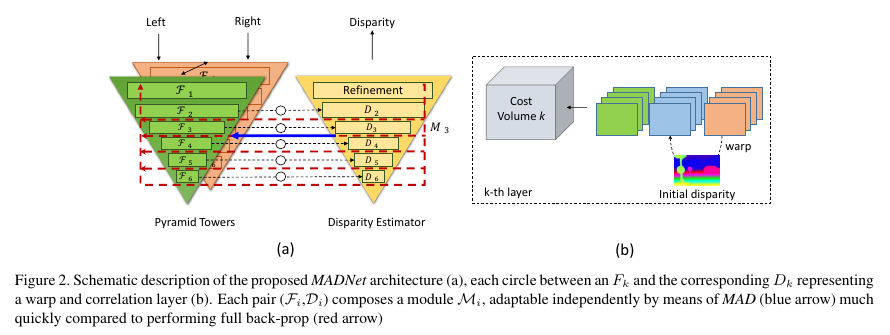

# Real-Time Self-Adaptive Deep Stereo
💡 **UPDATE!** Code for [Continual Adaptation for Deep Stereo](https://arxiv.org/pdf/2007.05233.pdf), accepted to **TPAMI**, is now available! Details under the 💡 **UPDATE!** tags

Code for [Real-time self-adaptive deep stereo](https://arxiv.org/abs/1810.05424), accepted as **ORAL** at **CVPR 2019**.

| [CVPR paper](https://arxiv.org/abs/1810.05424) | [CVPR video](https://www.youtube.com/watch?v=7SjyzDxmCY4) | [CVPR_Live_Demo](https://www.youtube.com/watch?v=4O-7OzVYAeU) |

| [TPAMI paper](https://arxiv.org/pdf/2007.05233.pdf) | [TPAMI video](https://www.youtube.com/watch?v=YnPGbQE2dLQ) |

| [ -Unofficial- Keras reimplementation by ChristianOrr](https://github.com/ChristianOrr/madnet-deep-stereo-with-keras) |



**Abstract**:

Deep convolutional neural networks trained end-to-end are the undisputed state-of-the-art methods to regress dense disparity maps directly from stereo pairs. However, such methods suffer from notable accuracy drops when exposed to scenarios significantly different from those seen in the training phase (e.g.real vs synthetic images, indoor vs outdoor, etc). As it is unlikely to be able to gather enough samples to achieve effective training/ tuning in any target domain, we propose to perform unsupervised and continuous online adaptation of a deep stereo network in order to preserve its accuracy independently of the sensed environment. However, such a strategy can be extremely demanding regarding computational resources and thus not enabling real-time performance. Therefore, we address this side effect by introducing a new lightweight, yet effective, deep stereo architecture Modularly ADaptive Network (MADNet) and by developing Modular ADaptation (MAD), an algorithm to train independently only sub-portions of our model. By deploying MADNet together with MAD we propose the first ever realtime self-adaptive deep stereo system.


If you use this code please cite: 
```
@InProceedings{Tonioni_2019_CVPR,
    author = {Tonioni, Alessio and Tosi, Fabio and Poggi, Matteo and Mattoccia, Stefano and Di Stefano, Luigi},
    title = {Real-time self-adaptive deep stereo},
    booktitle = {The IEEE Conference on Computer Vision and Pattern Recognition (CVPR)},
    month = {June},
    year = {2019}    
}

@article{Poggi2021continual,
    author={Poggi, Matteo and Tonioni, Alessio and Tosi, Fabio
            and Mattoccia, Stefano and Di Stefano, Luigi},
    title={Continual Adaptation for Deep Stereo},
    journal={IEEE Transactions on Pattern Analysis and Machine Intelligence (TPAMI)},
    year={2021}
}

```

## Requirements
This software has been tested with python3 and tensorflow 1.10. All required packages can be installed using pip and requirements.txt

```
pip3 install -r requirements.txt
```

## Pretrained Weights for Network
Pretrained weights for both DispNet and MADNet available [here](https://drive.google.com/open?id=1GwGxBOFx-NlUo9RAUgPlgPvaHCpGedlm).

## Online Adaptation Step by step on Video Sequences

1. Create a csv file for your video sequence similar to `example_list.csv`. 
   
    Each row should contain absolute paths to the input data in the following order:

    "*path_to_left_rgb*,*path_to_right_rgb*,*path_to_groundtruth*"

    Ground truth data will only be used to compute the network performance not for the online adaptation.
    
    💡 **UPDATE!** To run the TPAMI code, the csv file should contain absolute path to proxy disparities as well:
    
    "*path_to_left_rgb*,*path_to_right_rgb*,*path_to_groundtruth*,*path_to_proxies*"

2. Download pretrained network from [here](https://drive.google.com/open?id=1GwGxBOFx-NlUo9RAUgPlgPvaHCpGedlm).
3. Perform different kinds of online adaptation with `Stereo_Online_Adaptation.py`, to list all available options use  `python3 Stereo_Online_Adaptation.py -h`. 

Example of online adaptation using MADNet and MAD:
```bash
LIST="path/to/the/list/of/frames/" #the one described at step (1)
OUTPUT="path/to/output/folder"
WEIGHTS="path/to/pretrained/network"
MODELNAME="MADNet"
BLOCKCONFIG="block_config/MadNet_full.json"

python3 Stereo_Online_Adaptation.py \
    -l ${LIST} \
    -o ${OUTPUT} \
    --weights ${WEIGHTS} \
    --modelName MADNet \
    --blockConfig ${BLOCKCONFIG} \
    --mode MAD \
    --sampleMode PROBABILITY \
    --logDispStep 1
```
💡 **UPDATE!** To run the TPAMI code, just use the `Stereo_Continual_Adaptation.py` script instead

Additional details on available parameters:

+ **--modelName**: choose which disparity inference model to use, currently supports either "DispNet" or "MADNet"
+ **--mode**: how to perform online adaptation: NONE (no online adaptation only inference), FULL (adaptation by full online backprop), MAD (adaptation by partial backprop using MAD)
+ **--blockConfig**: path to a json file that specify how to subdivide the network into independent blocks for adaptation using MAD, some example are provided inside the `block_config` folder. Each innermost array inside the json file should correspond to layers belonging to the same independent group.
+ **--sampleMode**: specify how to sample portions of the network to train when using MAD. 
+ **--weights**: path to the initial weights for the network, e.g., referring to the weights linked above and assuming of having extracted the zip file in the same folder as the python script, to load MADNet trained on synthetic data use `--weights MADNet/synthetic/weights.ckpt`
+ **--logDispStep**: save the disparity predicted every this number of steps.


## Live inference and adaptation demo
The Demo sub-folder contains python code to run stereo online inference and/or adaptation from a webcam stream. Before running the demo you should implement in `Demo/grabber.py` a class that extends `ImageGrabber` and is tagged with the `@register_camera_to_factory()` decorator. The class should handle connection and disconnection from your stereo camera as well as all the op necessary to read/decode and rectify stereo frames. The file `grabber.py` contains: a commented `SmattCam` class  with an implementation for a custom stereo camera implemented on an FPGA and a `ZEDMini` class to connect to a ZED stereo camera.

Once you have implemented the code to connect to your camera you should be able to run the demo using the `Demo/Live_Adaptation_Demo.py` script. The script accepts a bunch of parameters from the command line to, all the options can be listed using

```python
python Live_Detection_Demo.py -h
```

Once started the script spawn two threads, one to read frames from the camera the others to process them through a stereo CNN. To stop execution just press something followed by `enter` on the shell where `Live_Detection_Demo.py` is running.

## Native Correlation layers

All the test in the paper were conducted using correlation layers implemented in pure tensorflow operations, however we provide also a native CUDA version of the same layer that might be usefull for deployment on memory constrained devices. To use the native correlation layer:
1. `cd Nets/Native`
2. `make`
3. `cd ..`
4. `vim sharedLayers.py`
5. Comment line 6, uncomment line from 12 to 19
